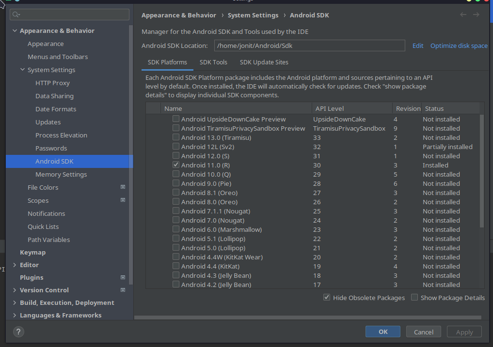

# Android Troubleshooting

[Capacitor Android Troubleshooting](https://capacitorjs.com/docs/android/troubleshooting)

## ERR_UNSUPPORTED_API_LEVEL: Unsupported API level: 32



To solve this issue:

1. Open Android Studio.
2. Go to **File > System Settings > Android SDK**.
3. Select **API level 32** and hit **Apply**.
4. Wait for the download to finish.
5. Try to re-run the command:

   ```bash
   yarn android:run:emulator-device
   ```

For more info, refer to [this issue comment](https://github.com/ionic-team/native-run/issues/219#issuecomment-1016503975).

---

## Error: SDK location not found. Define location with `sdk.dir` in the `local.properties` file or with an `ANDROID_HOME` environment variable.

1. Go to **File > Invalidate Caches… > Invalidate and restart**.

Alternatively, refer to this [StackOverflow solution](https://stackoverflow.com/a/44403002).
