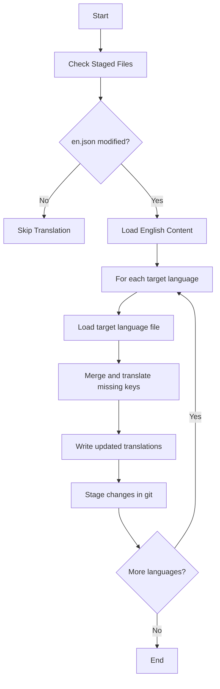

# Translation System

The project uses an automated translation system to manage localization files. The system is built around a script (`translate.js`) that automatically syncs translations across different language files when changes are made to the English source file.

It's automatically executed when you have staged changes to the English locale file, and try to commit your changes.

## How it Works

## Key Components

1. **File Detection**

   - The script monitors changes in locale files using Git staging
   - Only processes translations when changes are detected in `en.json`

2. **Language Support**

   - Currently supports translations for:
     - Portuguese (pt-br)
     - Japanese (ja)

3. **Translation Process**
   - Uses Google Translate API for automatic translations
   - Preserves existing translations
   - Only translates new or missing keys
   - Maintains nested structure of translation objects

## Implementation Details

The translation system follows these steps:

1. **Git Integration**

   - Checks for staged locale files using `simple-git`
   - Only proceeds if `en.json` has changes

2. **File Processing**

   - Reads the English source file
   - For each target language:
     - Loads existing translations
     - Creates new file if none exists
     - Preserves existing translations

3. **Translation Logic**

   - Recursively processes nested translation objects
   - Only translates missing keys
   - Maintains original structure

4. **Error Handling**
   - Gracefully handles translation API errors
   - Preserves original text if translation fails
   - Provides console feedback for debugging

## Usage

The translation system runs automatically when you stage changes to the English locale file. No manual intervention is required. Simply:

1. Make changes to `src/locales/en.json`
2. Stage the changes with git
3. The script will automatically process and create/update other language files

## Error Recovery

If translation fails for any reason:

- The original English text is preserved
- Error messages are logged to the console
- The process continues with remaining translations

This ensures that the application remains functional even if some translations fail to process.
